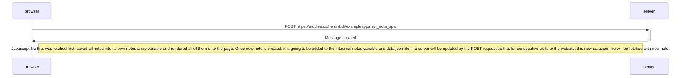

```mermaid
sequenceDiagram
    participant browser
    participant server

    browser->>server: POST https://studies.cs.helsinki.fi/exampleapp/new_note_spa
    activate server
    server->>browser: Message created
    deactivate server

    Note right of browser: Javascript file that was fetched first, saved all notes into its own notes array variable and rendered all of them onto the page. Once new note is created, it is going to be added to the inteernal notes variable and data.json file in a server will be updated by the POST request so that for consecutive visits to the website, this new data.json file will be fetched with new note.
```